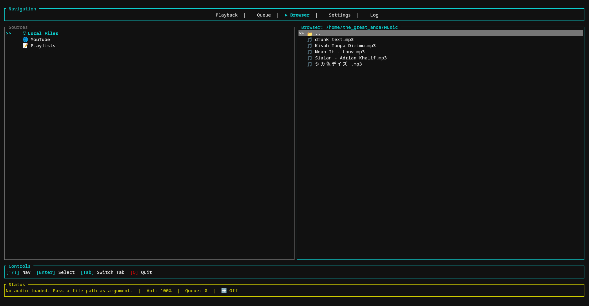
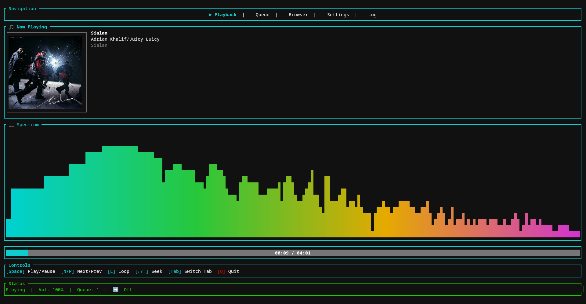
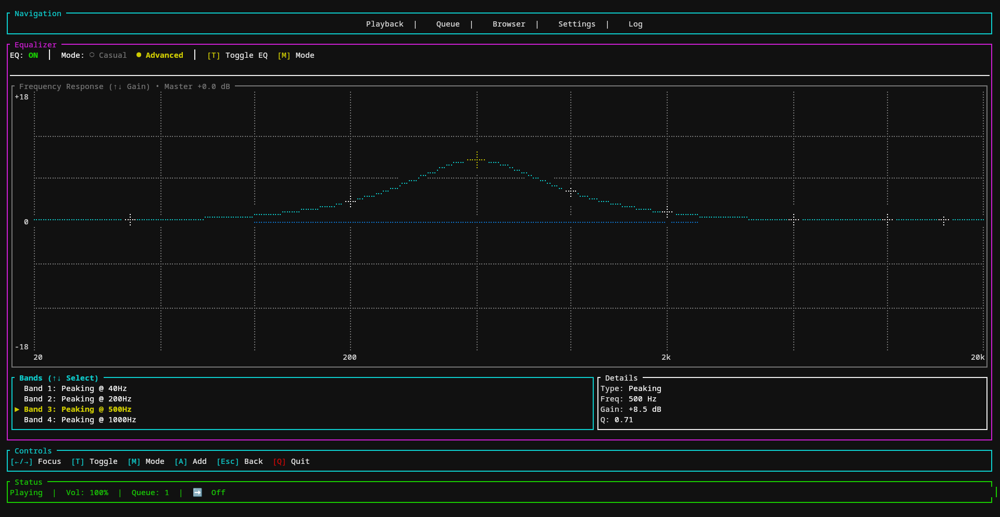
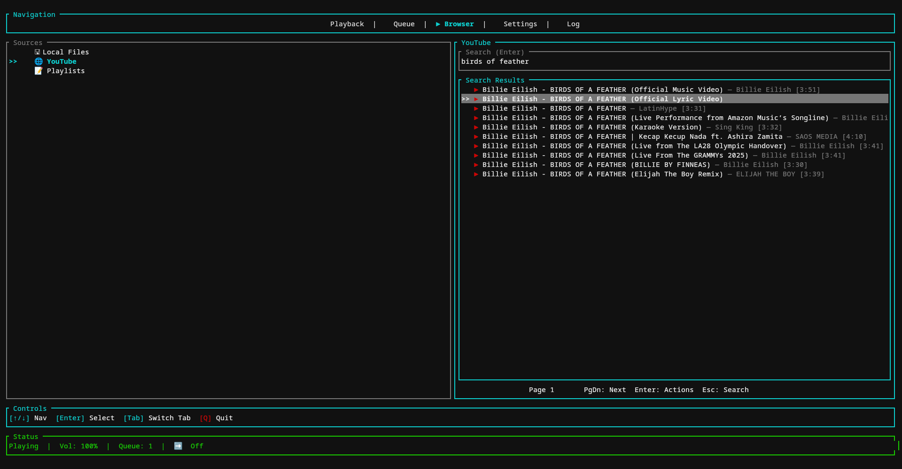
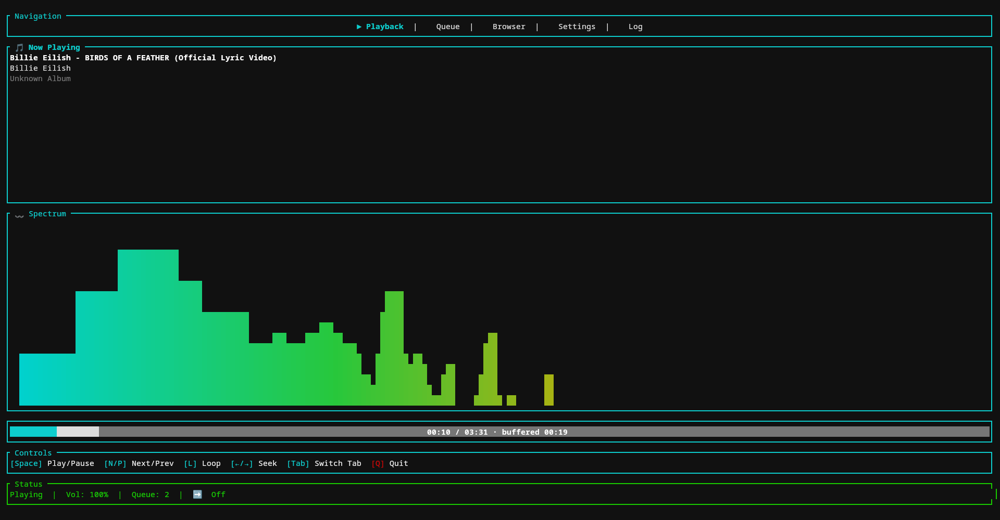

# Audido


<p align="center">
  <a href="docs/images/Audido-doc_1.png">
    
  </a>
  <a href="docs/images/Audido-doc_2.png">
    
  </a>
  <a href="docs/images/Audido_doc-3.png">
    
  </a>
  <a href="docs/images/Audido-doc_4.png">
    
  </a>
  <a href="docs/images/Audido-doc_5.png">
    
  </a>
</p>

Audido is a terminal-based audio player (TUI) written in Rust. It provides a local audio player and youtube audio player, queue management, and real-time DSP for the playback.

**Key Features**
- Local and youtube stream audio playback
- Queue management
- Browse local files and youtube search from the TUI
- Extensible DSP pipeline (EQ, normalization, pitch shifting, etc.). Only EQ is now available

## Install

Audido uses `ffmpeg` and `yt-dlp` for YouTube playback. The Debian and Scoop
packages declare these dependencies. Install them separately when using a raw
binary or macOS archive.

### Linux (Debian/Ubuntu)

Download the `.deb` for the latest release and install it with APT so runtime
dependencies are resolved:

```bash
sudo apt install ./audido_VERSION_amd64.deb
```

### Linux and macOS installer

The portable installer selects the latest x86_64 Linux or Intel/Apple-Silicon
macOS archive, verifies its SHA-256 checksum, and installs into `~/.local/bin`
for a normal user:

```bash
curl -fsSL https://github.com/nazhifhaidarputra/audido/releases/latest/download/install.sh | sh
```

On unsupported Linux architectures or musl-based distributions, it builds the
tagged source release locally. You can request that explicitly:

```bash
./install.sh --from-source
./install.sh --version 1.2.3 --prefix /opt/audido
```

For macOS YouTube playback, install the external tools with Homebrew:

```bash
brew install ffmpeg yt-dlp
```

### Windows

Each GitHub release includes all of these options:

- `audido-setup-...exe`: Inno Setup installer.
- `audido-tui-...exe`: standalone binary.
- `audido-...zip`: portable archive used by Scoop.
- `audido.json`: versioned Scoop manifest.

Install directly from the release manifest with Scoop:

```powershell
scoop install https://github.com/nazhifhaidarputra/audido/releases/latest/download/audido.json
```

The Scoop manifest installs `ffmpeg` and `yt-dlp` automatically. For the Inno
or standalone binary, install those tools separately and make sure they are on
`PATH`.

### Build from source

Prerequisites:

- The stable Rust toolchain (recommended via `rustup`).
- Linux only: `pkg-config` and ALSA development headers.
- Optional YouTube playback: `ffmpeg` and `yt-dlp` on `PATH`.

Clone the repository:

```bash
git clone https://github.com/nazhifhaidarputra/audido.git
cd audido
```

Install the Rust toolchain (if needed):

```bash
curl --proto '=https' --tlsv1.2 -sSf https://sh.rustup.rs | sh
rustup install stable
rustup default stable
```

## Build

Build the workspace (release):

```bash
cargo build --workspace --release
```

Build just the TUI binary (debug):

```bash
cargo build -p audido-tui
```

## Run

Run the TUI in debug mode:

```bash
cargo run -p audido-tui
```

Run the release binary:

```bash
cargo run --release -p audido-tui
# or run the built binary directly
./target/release/audido-tui
```

## Development

- To iterate quickly use `cargo run -p audido-tui`.
- Use `cargo test` to run tests for workspace crates (if any).
- The `audido-core` crate contains the DSP and audio engine code.

## Configuration & Notes

- The project uses a workspace layout. The main interactive binary lives in the `audido-tui` crate.
- Set `AUDIDO_FFMPEG` or `AUDIDO_YT_DLP` to use tools outside `PATH`.

## Releasing

The CI workflow checks Linux, Windows, macOS Apple Silicon, and macOS Intel.
Pushing a tag matching the workspace version runs the complete packaging and
GitHub Release pipeline:

```bash
# Update Cargo.toml, Cargo.lock, and CHANGELOG.md together.
./bump_version v1.2.3

# Review and commit the release, then create the matching tag.
git add Cargo.toml Cargo.lock CHANGELOG.md
git commit -m "Release v1.2.3"
git tag v1.2.3
git push origin HEAD v1.2.3
```

The release workflow also supports manual dispatch for an existing tag. It
publishes `SHA256SUMS` alongside every package.

## Contributors

Thanks to everyone who contributed. If your name or avatar is missing, open a PR to add yourself.

 - **nazhifhaidarputra** — https://github.com/nazhifhaidarputra  

If you want to add more contributors automatically, run:

```bash
git shortlog -sne --all
```

## Contributing

Contributions welcome — please open issues or PRs. For large changes, open an issue first to discuss the approach.

## License

This project is licensed under GPL-3.0 License — see the [LICENSE](LICENSE) file for details.
